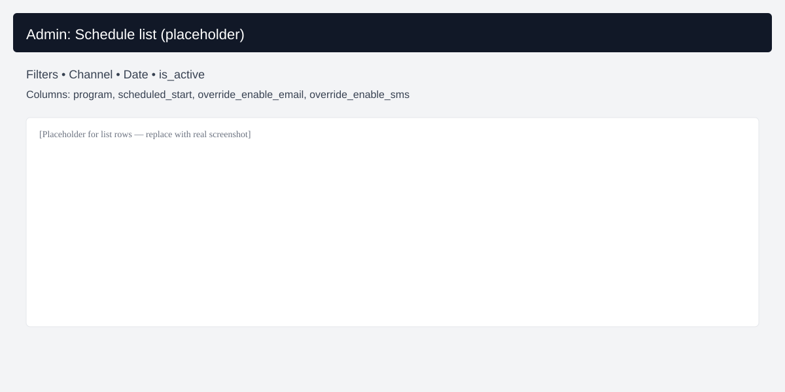
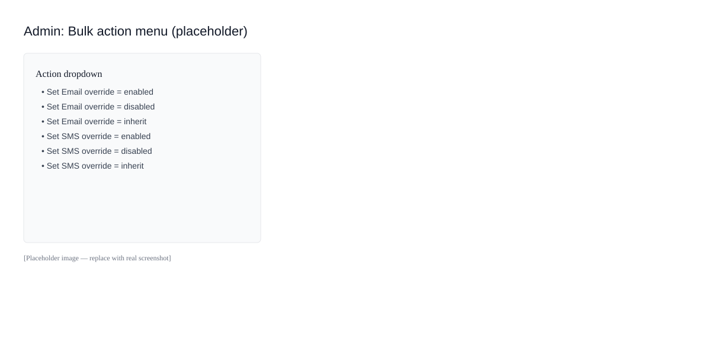
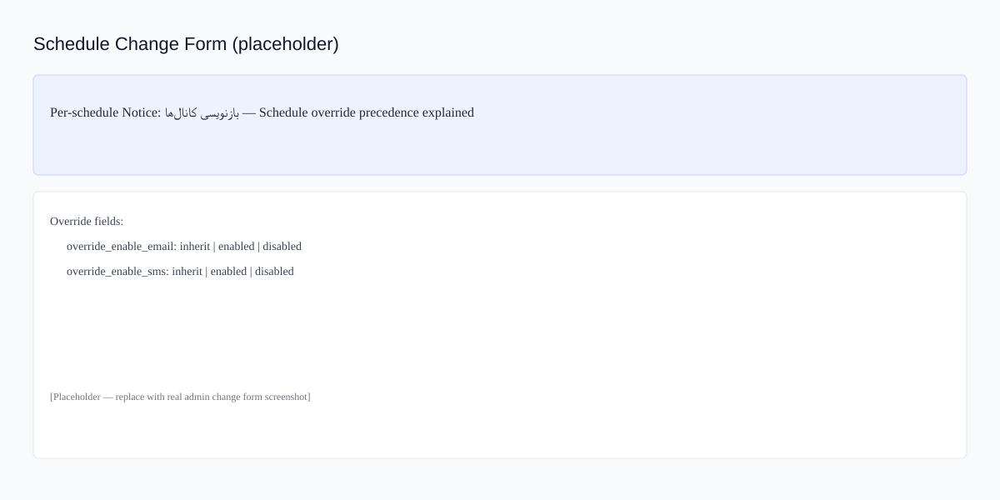
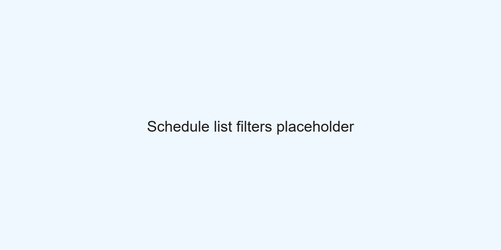

# Runbook: Per-schedule Channel Overrides

Purpose
- Quick operational guide for administrators and SREs to safely manage per-schedule
  overrides for alert delivery channels (Email / SMS).

Overview
- Each `Schedule` row has two tri-state fields:
  - `override_enable_email`: `inherit` | `enabled` | `disabled`
  - `override_enable_sms`: `inherit` | `enabled` | `disabled`
- Precedence: Schedule override → `ChannelSettings` → defaults (email: True, sms: True by historical compatibility).

When to use
- Emergency: temporarily disable SMS for a set of schedules during an outage.
- Safety: disable email for sensitive broadcasts.
- Testing: enable email/sms for a test schedule regardless of global settings.

Admin: Quick steps (recommended)
1. Navigate to Django Admin → `Schedule`.
2. Use filters to narrow to a set of schedules (by `channel`, `schedule_date`, etc.).
3. Select the schedules you want to change (checkboxes).
4. From the `Action` dropdown choose one of:
   - `Set Email override = enabled`
   - `Set Email override = disabled`
   - `Set Email override = inherit`
   - `Set SMS override = enabled`
   - `Set SMS override = disabled`
   - `Set SMS override = inherit`
5. Confirm — the action will update all selected rows and display a summary message.

Admin: Single schedule (change form)
1. Open a `Schedule` row in Admin.
2. Read the blue `Per-schedule` notice at the top for precedence details.
3. Change `بازنویسی: ایمیل` or `بازنویسی: پیامک` to the desired value and Save.

CLI: Management command
- You can create a test schedule and run the E2E command while applying overrides from the CLI:

```powershell
python manage.py send_test_alert --create --method=email --override-email=disabled
python manage.py send_test_alert --create --method=sms --override-sms=disabled
```

Notes and safety
- Bulk admin actions are immediate and affect selected rows. Use filters to reduce selection scope.
- Prefer `inherit` for long-term configuration; use `disabled`/`enabled` for temporary adjustments.
- For CI/E2E avoid using production credentials — prefer Mailtrap/Twilio trial accounts.
- The `send_test_alert` command prints a machine-readable `E2E_RESULT: {...}` JSON line that is recorded by Admin's E2E runner.

Rollback
- To revert a bulk change, re-run the same bulk action with `inherit` or the opposite state.

Contact
- If unsure, tag the on-call SRE and provide the schedule IDs and a short justification before making sweeping changes.

## Screenshots (placeholders)
For quick visual guidance, example placeholder images are stored in `docs/runbook/assets/` and will be replaced by real screenshots when available.







### How to capture screenshots (Windows 10/11, recommended)
1. Open the Admin page you want to capture in your browser (Chrome/Edge/Firefox).
2. Press `Win + Shift + S` to open the Snip & Sketch tool, select the rectangular snip mode, and capture the region.
3. Paste into an image editor (Paint or similar) and crop if needed. Save as PNG using one of the recommended filenames above.
4. Files should be roughly 1200px wide for good readability in docs; keep file size under ~500KB.

Once screenshots are added, update this file to embed them like:

```markdown

```
